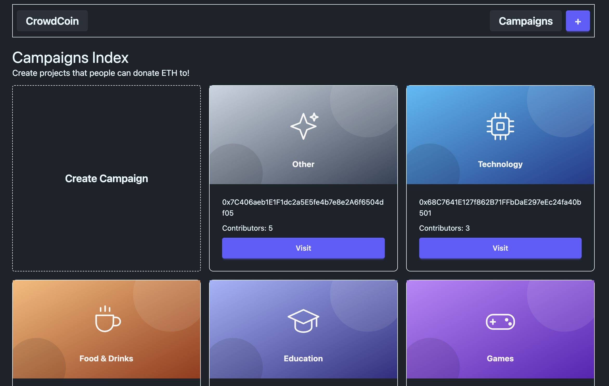
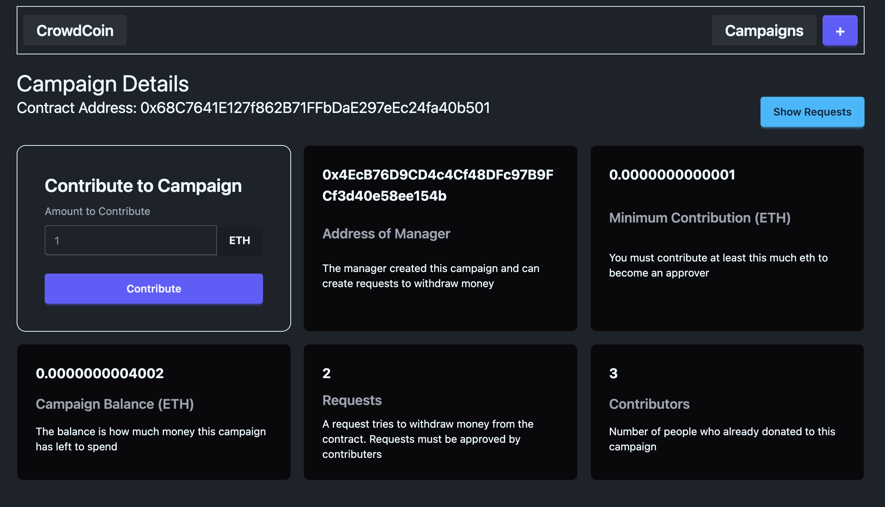
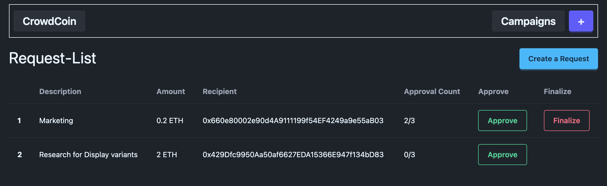

# CrowdCoin

CrowdCoin is a web3 implementation of Kickstarter: a crowdfunding platform for
innovative ideas and projects that solves the trust problem between investors and
founders.

With traditional crowdfunding you send money and hope the founder spends it as
promised. With CrowdCoin the money sits in the smart contract. The manager cannot
simply withdraw it — every expense has to be filed as a **request** with an amount
and a recipient address, and the payout only executes once **more than half of the
contributors** have approved it.

---

## Screenshots

### Campaigns index (`/`)

Every campaign deployed through the factory, each with its category thumbnail,
contract address and contributor count.



### Campaign details (`/campaigns/[address]`)

Live figures read straight from the contract (`getSummary()`), plus the form for
contributing ETH and thereby gaining voting rights.



### Request list (`/campaigns/[address]/requests`)

Each planned expense with its approval counter. *Approve* is open to every
contributor; *Finalize* only appears once the required majority is reached, and
only for the manager.



---

## Tech stack

| Area           | Technology                                              |
| -------------- | ------------------------------------------------------- |
| Smart contract | Solidity `^0.8.24`, compiled with `solc 0.8.x`          |
| Chain          | Ethereum Sepolia testnet                                |
| Web3 layer     | `web3.js 4.x`, `@truffle/hdwallet-provider`             |
| Frontend       | Next.js 16, React 19 (Pages Router)                     |
| Styling        | Tailwind CSS 4 + daisyUI 5                              |
| Tests          | Mocha + Ganache (local in-memory chain)                 |
| Wallet         | MetaMask                                                |

---

## Contract architecture

**`CampaignFactory`** — deploys campaigns and keeps their addresses in
`deployedCampaigns`. The factory is deployed once; its address lives in
`ethereum/factory.js`.

**`Campaign`** — one instance per project:

| Function                                      | Who can call it | Effect                                                                    |
| --------------------------------------------- | --------------- | ------------------------------------------------------------------------- |
| `contribute()`                                | anyone          | Sends ≥ `minimumContribution` and grants voting rights                    |
| `createRequest(description, value, recipient)`| manager only    | Files a planned expense                                                   |
| `approveRequest(index)`                       | contributors    | One vote per address per request                                          |
| `finalizeRequest(index)`                      | manager only    | Pays out — only if `approvalCount > contributorsCount / 2`                |
| `getSummary()`                                | anyone (view)   | Minimum, balance, request count, contributors and manager in one call     |

The category is an `enum` (`other` deliberately at index 0, so uninitialised
storage does not silently become "technology") and `immutable`. Labels and
thumbnails stay off-chain under `public/categories/`; only the index is stored
on-chain.

---

## Getting started — pick a path

|                          | **A · Quick view**                             | **B · Self-deploy**                                    |
| ------------------------ | ---------------------------------------------- | ------------------------------------------------------ |
| What you get             | The live app on my deployed factory            | Your own factory, your own campaigns                    |
| Contracts                | Already deployed, prebuilt ABIs in the repo    | You compile and deploy them yourself                    |
| `.env` needed            | No                                             | Yes (`MNEMONIC`, `NEXT_PUBLIC_SEPOLIA_RPC_URL`)                     |
| Seed phrase needed       | No                                             | Yes — use a throwaway testnet wallet                    |
| Sepolia ETH needed       | Only to contribute or create a campaign        | Yes, to pay deployment gas                              |
| Time                     | ~3 minutes                                     | ~15 minutes                                             |

Both paths need **Node.js ≥ 20** and **[MetaMask](https://metamask.io/)** set to
the **Sepolia** network. Get free test ETH from the
[Google Cloud faucet](https://cloud.google.com/application/web3/faucet/ethereum/sepolia)
or the [Alchemy faucet](https://sepoliafaucet.com/).

---

## A · Quick view

Runs against the factory already deployed at
`0x1e22fA07f40221A96ffd251E67553d12066C8144` on Sepolia. The compiled ABIs live in
`ethereum/build/` and are committed, so there is nothing to compile and no `.env`
to write.

```bash
git clone https://github.com/NeXo333Xo/CrowdCoin.git
cd CrowdCoin
npm install
npm run dev
```

→ [http://localhost:3000](http://localhost:3000)

You'll immediately see the existing campaigns and can browse every detail and
request page — reading is free and works even without MetaMask, via the fallback
RPC in `ethereum/web3.js`.

To **contribute**, **create a campaign**, or **approve a request**, install metamask and
use the Mnemonic from the .env file, it already has some Sepolia test Ether.

What you can try in a couple of minutes:
(remember that other people used the test wallet too, so some functionality
was testet on the same campaign. Create a new Campaign to avoid unexpected behaviour.)

1. Open a campaign and contribute slightly more than its minimum → you become a
   contributor and gain a vote.
2. Go to **Show Requests** and approve an open request → the approval counter
   goes up.
3. Create your own campaign via **+** in the header → it shows up on the index
   right away, with you as manager.

That's the whole read/write loop. If you'd rather own the factory contract
yourself, continue with path B.

---

## B · Self-deploy

Full process: compile the contracts, deploy your own factory to Sepolia, point
the frontend at it.

### 1. Clone the repository and install dependencies

```bash
git clone https://github.com/NeXo333Xo/CrowdCoin.git
cd CrowdCoin
npm install
```

Additionally you'll need a Sepolia RPC endpoint, e.g. from
[Alchemy](https://www.alchemy.com/) or [Infura](https://www.infura.io/) — both
have a free tier.

### 2. Edit the `.env` file

In the **project root** (same level as `package.json`).

```bash
nano .env
```

Contents:

```dotenv
MNEMONIC="word1 word2 word3 ... word12"
NEXT_PUBLIC_SEPOLIA_RPC_URL="https://eth-sepolia.g.alchemy.com/v2/YOUR_API_KEY"
```

#### Where does `MNEMONIC` come from?

It's the 12-word seed phrase of the wallet you deploy from. In MetaMask:
**Settings → Security & Privacy → Reveal Secret Recovery Phrase**. Put the twelve
words in quotes, separated by single spaces.

`HDWalletProvider` derives the first account from it — that account pays the gas
and becomes the owner of the factory, so it needs Sepolia ETH.

> **Security note:** use a **throwaway wallet dedicated to testnets**. Never use
> the seed phrase of a wallet holding real funds on mainnet. Whoever has the
> phrase has the wallet — completely and irreversibly.

#### Where does `NEXT_PUBLIC_SEPOLIA_RPC_URL` come from?

An HTTPS endpoint to a Sepolia node. With Alchemy:

1. Create an account at [alchemy.com](https://www.alchemy.com/)
2. **Create App** → chain *Ethereum*, network *Sepolia*
3. Copy the URL under **API Key → HTTPS**

It looks like `https://eth-sepolia.g.alchemy.com/v2/<API_KEY>`. On Infura the
equivalent is `https://sepolia.infura.io/v3/<PROJECT_ID>`.


### 3. Compile the contracts

```bash
node ethereum/compile.js
```

Produces `ethereum/build/Campaign.json` and `ethereum/build/CampaignFactory.json`
(ABI + bytecode). The folder is wiped and regenerated on every run, overwriting
the versions committed to the repo.

### 4. Run the tests

```bash
npm test
```

Runs against a local in-memory Ganache instance — costs no real ETH and needs
neither a mnemonic nor an RPC URL.

### 5. Deploy the factory

```bash
node ethereum/deploy.js
```

Final output:

```
Contract deployed to (0x......)
```

Put that address into **`.env as NEXT_PUBLIC_FACTORY_ADDRESS `**:

This step matters because otherwise the frontend keeps pointing at my factory and
your fresh deployment stays invisible — the index will look empty, which is
correct: a new factory has no campaigns yet.

### 6. Start the dev server

```bash
npm run dev
```

→ [http://localhost:3000](http://localhost:3000)

MetaMask has to be on **Sepolia**, otherwise every write transaction fails.

---

## Project structure

```
CrowdCoin/
├── components/              # Layout, header, cards, forms
├── ethereum/
│   ├── contracts/
│   │   └── Campaign.sol     # CampaignFactory + Campaign
│   ├── build/               # generated by compile.js (not in the repo)
│   ├── compile.js           # Solidity → ABI + bytecode
│   ├── deploy.js            # deploys the factory to Sepolia
│   ├── factory.js           # factory instance for the frontend
│   ├── campaign.js          # factory function for Campaign instances
│   └── web3.js              # MetaMask provider with HTTP fallback
├── lib/                     # category definitions, helpers
├── pages/
│   ├── index.js                                # campaigns index
│   └── campaigns/
│       ├── new.js                              # create a campaign
│       └── [address]/
│           ├── index.js                        # details page
│           └── requests/
│               ├── index.js                    # request list
│               └── new.js                      # create a request
├── public/categories/       # category SVGs (1200×630)
├── styles/
├── test/                    # Mocha tests against Ganache
└── .env                     # local, not in the repo
```

---

## Common pitfalls

| Symptom                                             | Cause / fix                                                                |
| --------------------------------------------------- | -------------------------------------------------------------------------- |
| `Cannot read properties of undefined` in `deploy.js` | `.env` missing, not in the root, or `MNEMONIC` misspelled                  |
| `insufficient funds for gas`                         | The first account of the mnemonic has no Sepolia ETH → use a faucet        |
| Frontend shows no campaigns                          | Path B: expected — a fresh factory is empty. Path A: address in `factory.js` was changed |
| `Cannot find module './build/CampaignFactory.json'`  | Forgot `node ethereum/compile.js` before deploying                         |
| Transaction fails with no error message              | MetaMask is on the wrong network (must be Sepolia)                         |
| `Finalize` does nothing                              | `approvalCount` is not yet **above** half the contributor count            |

---

## License

ISC — see `package.json`. The smart contract is MIT (SPDX header in
`Campaign.sol`).